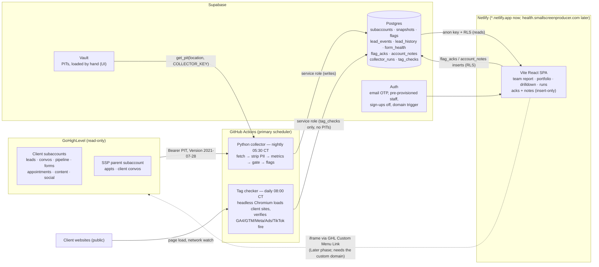

# GHL Account Health Dashboard — As-Built Architecture (spec v3.0)

This document describes what was actually built, module by module. The
authoritative requirements are in [`DESIGN.md`](DESIGN.md) (build spec v3.0,
consolidated); API field-level verification status lives in
[`../VERIFICATION.md`](../VERIFICATION.md).

## System overview



(Render remains available as an optional alternative scheduler via
`render.yaml`; run exactly one of the two.)

Trust boundaries:

1. **GHL → collector**: one read-only PIT per subaccount, hand-loaded into
   the Supabase Vault UI as `ghl_pit_<location_id>`. The client refuses
   non-GET methods except the two documented search POSTs.
2. **PII boundary**: `fetchers.py` projects every record through a whitelist
   before returning it — phone numbers, email addresses, and message bodies
   never leave the fetch layer (presence booleans like `has_phone` replace
   the values). `tests/test_pii.py` asserts canary values never reach any
   stored row.
3. **Collector → Postgres**: the service role, plus `COLLECTOR_KEY` required
   by the Vault RPCs — a leaked service-role key alone cannot read PITs.
   Every read/set/rotate/denial is audited in `pit_audit`.
4. **Postgres → browser**: the anon key holds zero object privileges;
   `authenticated` can select everything and insert (never update/delete)
   into `flag_acks` and `account_notes`, all gated by `is_staff()` RLS,
   with `FORCE ROW LEVEL SECURITY` and stripped default grants. Views run
   `security_invoker`.

## Repository layout

```
supabase/
  migrations/0001_init.sql   base schema: 8 tables, 2 views, RLS + FORCE,
                             auth triggers, Vault RPCs, least-privilege grants
  migrations/0002..0006      missed calls · form_health + forms_silent_ct ·
                             tag_checks + tag_config · opps_moved_30d ·
                             bottleneck columns (all applied to the live project)
  seed.sql                   parent + pilot rows (edit before running)
collector/                   Python 3.11, no framework
  main.py                    CLI + orchestration (probe / dry-run / collect / backfill)
  ghl_client.py              HTTP client: 8 rps bucket, retries, sanitized errors
  fetchers.py                per-endpoint fetchers + Coverage + PII whitelists
  metrics.py                 pure metric functions (injected clock, no I/O)
  flags.py                   23-code flag catalog + per-account threshold overrides
  store.py                   supabase-py persistence + Vault RPC wrappers
  digest.py                  Monday digest builder (parked — off by default)
  tools/pit.py               optional CLI (Vault UI is the primary token path)
  tools/find_client_contact.py
  tests/                     full mock run + PII boundary + per-feature tests
tagchecker/                  Playwright tag/pixel checker (own requirements.txt);
                             reads subaccounts.tag_config, writes tag_checks,
                             touches no GHL tokens; pure logic unit-tested
.github/workflows/
  collector.yml              nightly collection (manual dispatch: args box
                             feeds COLLECTOR_ARGS — --probe, --backfill 12, ...)
  tagchecker.yml             daily tag check (installs Chromium on the runner)
web/                         Vite + React + TypeScript + Tailwind + Recharts
  src/pages/                 Login (email OTP), Portfolio, Account, Runs
  src/lib/                   supabase client, DB types, Details contract,
                             insights (team report), grade (triage bands), writes
  src/components/            table/badge/tile primitives, SVG sparkline, heatmap
docs/                        DESIGN.md (spec v3, historical requirements) ·
                             GO-LIVE.md (setup, browser-only) ·
                             FORMS-INTEGRATION.md (forms/tags review + design) ·
                             this file (as-built)
render.yaml                  OPTIONAL alternative scheduler (GitHub Actions is primary)
netlify.toml                 Netlify build + SPA redirect + frame-ancestors CSP
VERIFICATION.md              endpoint-shape verification log (--probe appends here)
```

## Collector

### Run sequence (`main.py`)

1. `pit_key_ok` RPC must pass or the run finishes as failed (exit 1).
2. Load active subaccounts; `--location <id|slug>` narrows to one (the
   parent context is still built).
3. **Parent first**: SSP-account calendars + events ±60 days, indexed by
   contact ID; the parent gets its own snapshot too.
4. Per client subaccount: G1 identity check (name match normalizes `&`/`and`;
   a mismatch records both names in coverage) → one 42-day contacts fetch
   (covers the 7d window, 28-day baseline, 14–42d conversion cohort, and
   28d funnel), earliest-contact probe, per-status opportunities (open all
   pages, won/lost stopped at the 90d cutoff), 14 days of conversations,
   form submissions, review-tagged contacts, calendar events [-28d, +7d],
   blogs/social/social-accounts when `services` warrant, **form/survey
   inventory** (every form + survey, one count-and-latest request each,
   business-day silence classification), **workflow inventory** (published
   vs draft counts) → metrics + chart aggregates → write snapshot,
   `lead_events`, `lead_history` (current + previous ISO week), and
   `form_health` (per-form rows). Surveys/workflows scopes missing on a
   token record as SKIPPED (never gate-tripping) until granted. An account
   with no PIT yet is "awaiting onboarding" — visible everywhere, counted
   separately, never a run failure.
5. **Peer pass**: vertical medians (n ≥ 4, whole-book fallback) written back;
   flags computed per location, `flags_new`/`flags_resolved` diffed against
   the codes stored 7 days ago, flags replaced, snapshot change-columns
   updated.
6. Finish run with per-location `details` {status, gate, requests, 429s,
   seconds, error}. Exit 0 / 2 (held or failed) / 1 (crash).

`--backfill N` is a standalone mode: bucket N ISO weeks of contacts (and
form submissions when available) into `lead_history` so charts are populated
on day one. Safe to rerun.

### Data-quality machinery

- **Coverage** per source: `{retrieved, exhausted, error, note, skipped}` →
  complete / partial / unavailable / skipped. Skipped sources (delivery when
  content/social is not sold; relationship without a client contact id)
  never count against the gate.
- **Gate**: G1 location identity, G2 <2 unavailable, G3 <2 partial, G4
  sudden all-zero held unless the previous three gate-passed snapshots were
  also all-zero. Held snapshots store `gate_passed=false`; the UI shows
  "no data", never zeros.
- **Live baseline** (v3): trailing average computed from the 28 days of CRM
  history before the 7d window — no waiting period. `trailing_n` counts only
  baseline weeks after the account's first contact.

### Metric highlights

All in `metrics.py`, pure functions with an injected clock: 7-full-local-day
windows; the Friday-17:00/weekend response-clock rule; whole-word test/demo
exclusions; human-vs-automation first-touch classification (cap 100 newest
contacts); per-source lead counts and weekly source averages; unassigned and
missing-phone hygiene (presence only); form-submission windows;
stale/stuck/no-next-step pipeline states with per-account `opp_idle_days` /
`opp_stuck_days` thresholds; 90d win rate and median days-to-close; the
14–42d lead→opp cohort; appointment booked/showed/no-show; social-account
expiry counts; flag change tracking; per-form/per-survey health
(`classify_form`, business-day silence clock — weekends never count);
pipeline movement over 30 days (created / stage-changed / closed); and the
chart aggregates, always over the FULL opportunity set: stage distribution
(count, idle count, value, idle value, median days in stage, orphaned-stage
detection), idle-time aging buckets, weekly won/lost, pipeline-setup hygiene
(empty pipelines, deals stranded in deleted stages), win rate per pipeline,
and the bottleneck (the stage holding the most idle dollars, also stored as
snapshot columns for the portfolio).

## Database

Ten tables (`subaccounts` with `mrr`/`contract_end`/`tag_config`,
`snapshots`, `flags`, `lead_events`, `lead_history`, `form_health`,
`tag_checks`, `flag_acks`, `account_notes`, `collector_runs`) plus
`pit_audit`, and two `security_invoker` views. `v_portfolio` has grown
(columns appended by migrations 0002–0006): `calls_missed_7d`,
`forms_silent_ct`, `opps_moved_30d`, `bottleneck_stage`,
`bottleneck_value_usd`.
`v_portfolio` weighs acknowledged flags at zero via a lateral join against
active (un-expired) `flag_acks` rows, so an ack immediately drops the
account out of "needs attention"; a red that returns after the snooze
expires is a genuinely stale problem. Acks and notes are append-only: no
update/delete policies or grants exist, and RLS pins `acked_by`/`author` to
the JWT email. Public sign-up is disabled and staff are pre-provisioned; the
`auth.users` insert/update triggers are the backstop.

## Frontend

- **Auth**: Supabase email OTP for pre-provisioned staff
  (`shouldCreateUser: false`); an unregistered address gets "Not a
  registered staff account." Works identically standalone and inside the
  GHL iframe (same-site hosting).
- **Global chrome**: snapshot-age banner from the latest collector run;
  state rendered as icon + color (● / ▲ / ✓ / –), never color alone;
  keyboard (`j`/`k` select, `Enter` open, `a` acknowledge top flag, `/`
  search); 15-minute auto-refresh; filter/sort state in the URL.
- **Portfolio (the AM morning review)**: triage chips (● Needs attention ·
  ◐ Watch · ✓ Healthy · ○ No data — each a click-filter) with MRR-at-risk
  and a data-as-of stamp → the **Team report** (one template-filled plain
  sentence per account, worst first — every phrase traceable to a metric;
  steady and awaiting-token accounts roll up into single lines) → the
  "new this week" strip from `flags_new` → the table: lean default row
  (state/flags, leads with trend arrow + sparkline, speed, missed calls,
  MRR, top action, days-since-last-note) with everything else — including
  Silent forms, Moves 30d, and Bottleneck — behind the localStorage column
  chooser; filters (mine/all, SSP, search, vertical, state, flag code,
  band), attention or MRR-at-risk sort, group-by-AM, a **Wall** layout
  toggle (one tile per account for a big monitor), CSV export of the
  current view.
- **Drilldown**: header (MRR / contract end) → **Do next** (top 3 unacked
  flags with Acknowledge + note + 7/14/30-day snooze; acked flags muted
  with who/when/note) → **Changed this week** chips → KPI tiles (incl.
  deals-moved-30d, no-show %, lead→opp %, win rate) → **"This week vs
  last" change scorecard** (nine metrics vs the newest gate-passed snapshot
  6+ days older, direction-aware arrows) → 28d funnel strip →
  stacked-by-source weekly leads chart and a delta-vs-peers panel →
  **won/lost weekly diverging bars** → **speed-to-lead trend line** →
  **stage bar + velocity/value table with the bottleneck callout** →
  **pipeline-setup hygiene card** (orphaned deals, empty pipelines) →
  **win rate by pipeline** (multi-pipeline accounts) → **deal-aging
  buckets** → after-hours heatmap → speed histogram → detail tables
  (titles show TRUE counts, "top 50 shown" when capped) → **Forms &
  surveys** per-form health → **Tracking tags** (latest tag-checker
  result) → coverage (the honesty layer) → copy-ready weekly client
  summary → append-only notes.
- **Runs**: last 30 runs with expandable per-location detail, plus a token
  health list (status ≠ ok or rotation older than 80 days).

## Deploys & operations

- **Collector**: GitHub Actions (`.github/workflows/collector.yml`),
  nightly `30 10 * * *` UTC = 05:30 CT during CDT (revisit in November);
  three repo secrets (`SUPABASE_URL`, `SUPABASE_SERVICE_ROLE_KEY`,
  `COLLECTOR_KEY`). Manual runs via the Actions tab; the args box feeds
  `COLLECTOR_ARGS` (`--probe`, `--backfill 12`, ...). A failed scheduled
  run emails the repo owner — the dead-man's switch. Render (`render.yaml`)
  is a documented alternative; run exactly one scheduler.
- **Tag checker**: GitHub Actions (`tagchecker.yml`), daily 08:00 CT,
  installs Chromium on the runner; needs only the two Supabase secrets and
  no GHL tokens. Skips accounts without `tag_config` expectations.
- **SPA**: Netlify from `web/`, auto-deploys on every push. Lives at the
  free `*.netlify.app` URL until the Later phase adds
  `health.smallscreenproducer.com`; `frame-ancestors` CSP for GHL hosts, no
  `X-Frame-Options`.
- **Auth email**: Supabase's built-in mailer (delivers only to Supabase org
  members, a few per hour — fine for admins). Team-scale rollout switches
  SMTP to the agency's own Google Workspace (app password). No third-party
  email service; Resend was removed from the design by decision.
- **GHL embed**: Custom Menu Link (spec section 10) is a Later-phase step —
  in-iframe sign-in requires the custom domain (same-site with
  `crm.smallscreenproducer.com`).

## Tier 2 features (shipped on request, 2026-08-18)

- **Missed inbound calls** — the recent-conversation scan pulls messages for
  call conversations (cap 30/location, noted in coverage) and counts inbound
  `TYPE_CALL` messages whose `meta.call.status` says nobody answered
  (vocabulary is VERIFY). Snapshot column `calls_missed_7d`
  (migration `0002`), a drilldown tile + table, and a portfolio column.
- **After-hours heatmap** — pure UI on `lead_events`: 7×24 grid in the
  account's timezone, sequential single-hue ramp, toggle between arrival
  counts and median first response, business hours outlined.
- **Monday digest (parked — off by default)** — `collector/digest.py` builds
  one plain-text email per AM (attention list with actions and MRR,
  changed-this-week, steady/no-data rollups; acked flags excluded;
  recipients restricted to `@smallscreenproducer.com`). Sending requires an
  email API key that is deliberately NOT part of the go-live setup; with
  nothing configured every run skips the digest as a logged no-op. Preview
  without sending: `python -m collector.main --digest --dry-run`.
- **Copy-ready weekly client summary** — deterministic template fill in the
  drilldown (`web/src/lib/clientSummary.ts`): client-facing wording, unknown
  lines omitted, no flag/risk language, one-click copy.

## Forms, surveys, workflows & tag monitoring (2026-08-19)

Full review + design record: [`FORMS-INTEGRATION.md`](FORMS-INTEGRATION.md).

- **Per-form / per-survey health** — nightly inventory of every form and
  survey with lifetime submission count + newest submission (one request
  each via `meta.total`); classified active / silent / no-leads / new /
  unknown with a business-day silence clock. Rows accumulate in
  `form_health` (history: "when did this form die" is answerable). Flags:
  `FORM_WENT_SILENT`, `SURVEY_WENT_SILENT` (both name the silent items).
- **Workflow inventory** — published vs draft counts;
  `WORKFLOWS_NONE_PUBLISHED` fires when leads flow but nothing automates
  follow-up. Requires `workflows.readonly` (policy exception approved).
- **Tag/pixel monitoring** — `tagchecker/` loads each configured client
  site in headless Chromium, watches real network requests, and verifies
  the expected GA4 / GTM / Meta pixel / Google Ads / TikTok tags fired
  (optionally with the exact ID). Config in `subaccounts.tag_config`
  (websites seeded for all 31 accounts); results in `tag_checks`; shown on
  the account page.

## Pipeline intelligence (2026-08-19, pipelines.readonly on all PITs)

- `opps_moved_30d` — deals created / stage-changed / closed in 30 days;
  `PIPELINE_FROZEN` (red at zero movement with 10+ open deals, amber under
  5% moved).
- `PIPELINE_HYGIENE` — when 50+ deals AND 60%+ of the open pipeline are
  idle, the framing switches from "re-engage each deal" to "book a
  cleanup"; it replaces `STALE_PIPELINE` on those accounts so thousand-deal
  pipelines stop producing unusable advice.
- Stage table (velocity: median days in stage; value and idle $ per stage;
  orphaned-stage detection), bottleneck callout + snapshot columns +
  portfolio column + `PIPELINE_BOTTLENECK` info flag, pipeline-setup
  hygiene card, win rate per pipeline.
- Honest capping: drilldown list titles show the TRUE metric count with
  "top 50 shown" when the example rows are truncated; chart aggregates are
  computed over the full deal set and never capped.

## Deviations from the spec

Logged in detail in `VERIFICATION.md`; the headlines:

1. Reference implementation (`ghl_am_brief.py`) was unreachable from the
   build environment — reimplemented from the spec text and locked with the
   spec's own test list.
2. Built in `matthewcarlsonhome-cmd/GHLReports` on the session branch, not
   `smallscreenproducer/ghl-health`.
3. Peer median rendered as its own delta panel instead of a band on the
   counts chart (one-axis rule).
4. Peer pass uses gate-passed snapshots only.
5. One extra earliest-contact probe call per location feeds `trailing_n`.
6. The single 42-day contacts fetch covers the 14–42d conversion cohort.
