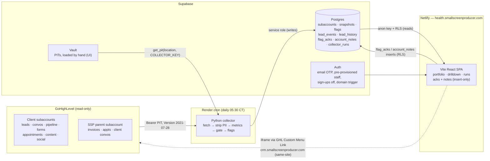

# GHL Account Health Dashboard — As-Built Architecture (spec v3.0)

This document describes what was actually built, module by module. The
authoritative requirements are in [`DESIGN.md`](DESIGN.md) (build spec v3.0,
consolidated); API field-level verification status lives in
[`../VERIFICATION.md`](../VERIFICATION.md).

## System overview



Trust boundaries:

1. **GHL → collector**: one read-only PIT per subaccount, hand-loaded into
   the Supabase Vault UI as `ghl_pit_<location_id>`. The client refuses
   non-GET methods except the two documented search POSTs.
2. **PII boundary**: `fetchers.py` projects every record through a whitelist
   before returning it — phone numbers, email addresses, and message bodies
   never leave the fetch layer (presence booleans like `has_phone` replace
   the values). `tests/test_pii.py` asserts canary values never reach any
   stored row.
3. **Collector → Postgres**: the service role, plus `COLLECTOR_KEY` required
   by the Vault RPCs — a leaked service-role key alone cannot read PITs.
   Every read/set/rotate/denial is audited in `pit_audit`.
4. **Postgres → browser**: the anon key holds zero object privileges;
   `authenticated` can select everything and insert (never update/delete)
   into `flag_acks` and `account_notes`, all gated by `is_staff()` RLS,
   with `FORCE ROW LEVEL SECURITY` and stripped default grants. Views run
   `security_invoker`.

## Repository layout

```
supabase/
  migrations/0001_init.sql   complete schema: 8 tables, 2 views, RLS + FORCE,
                             auth triggers, Vault RPCs, least-privilege grants
  seed.sql                   parent + pilot rows (edit before running)
collector/                   Python 3.11, no framework
  main.py                    CLI + orchestration (probe / dry-run / collect / backfill)
  ghl_client.py              HTTP client: 8 rps bucket, retries, sanitized errors
  fetchers.py                per-endpoint fetchers + Coverage + PII whitelists
  metrics.py                 pure metric functions (injected clock, no I/O)
  flags.py                   17-code flag catalog + per-account threshold overrides
  store.py                   supabase-py persistence + Vault RPC wrappers
  tools/pit.py               optional CLI (Vault UI is the primary token path)
  tools/find_client_contact.py
  tests/                     56 tests incl. full mock run + PII boundary test
web/                         Vite + React + TypeScript + Tailwind + Recharts
  src/pages/                 Login (email OTP), Portfolio, Account, Runs
  src/lib/                   supabase client, DB types, Details contract, writes
  src/components/            table/badge/tile primitives, SVG sparkline
docs/                        DESIGN.md (spec v3, authoritative) + this file
render.yaml                  Render cron blueprint (collector)
netlify.toml                 Netlify build + SPA redirect + frame-ancestors CSP
VERIFICATION.md              endpoint-shape verification log (--probe appends here)
```

## Collector

### Run sequence (`main.py`)

1. `pit_key_ok` RPC must pass or the run finishes as failed (exit 1).
2. Load active subaccounts; `--location <id|slug>` narrows to one (the
   parent context is still built).
3. **Parent first**: SSP-account invoices (all pages), calendars + events
   ±60 days, indexed by contact ID; the parent gets its own snapshot too.
4. Per client subaccount: G1 identity check → one 42-day contacts fetch
   (covers the 7d window, 28-day baseline, 14–42d conversion cohort, and
   28d funnel), earliest-contact probe, per-status opportunities (open all
   pages, won/lost stopped at the 90d cutoff), 14 days of conversations,
   form submissions, review-tagged contacts, calendar events [-28d, +7d],
   blogs/social/social-accounts when `services` warrant → metrics → write
   snapshot, `lead_events`, and `lead_history` (current + previous ISO week).
5. **Peer pass**: vertical medians (n ≥ 4, whole-book fallback) written back;
   flags computed per location, `flags_new`/`flags_resolved` diffed against
   the codes stored 7 days ago, flags replaced, snapshot change-columns
   updated.
6. Finish run with per-location `details` {status, gate, requests, 429s,
   seconds, error}. Exit 0 / 2 (held or failed) / 1 (crash).

`--backfill N` is a standalone mode: bucket N ISO weeks of contacts (and
form submissions when available) into `lead_history` so charts are populated
on day one. Safe to rerun.

### Data-quality machinery

- **Coverage** per source: `{retrieved, exhausted, error, note, skipped}` →
  complete / partial / unavailable / skipped. Skipped sources (delivery when
  content/social is not sold; relationship without a client contact id)
  never count against the gate.
- **Gate**: G1 location identity, G2 <2 unavailable, G3 <2 partial, G4
  sudden all-zero held unless the previous three gate-passed snapshots were
  also all-zero. Held snapshots store `gate_passed=false`; the UI shows
  "no data", never zeros.
- **Live baseline** (v3): trailing average computed from the 28 days of CRM
  history before the 7d window — no waiting period. `trailing_n` counts only
  baseline weeks after the account's first contact.

### Metric highlights

All in `metrics.py`, pure functions with an injected clock: 7-full-local-day
windows; the Friday-17:00/weekend response-clock rule; whole-word test/demo
exclusions; human-vs-automation first-touch classification (cap 100 newest
contacts); per-source lead counts and weekly source averages; unassigned and
missing-phone hygiene (presence only); form-submission windows;
stale/stuck/no-next-step pipeline states with per-account `opp_idle_days` /
`opp_stuck_days` thresholds; 90d win rate and median days-to-close; the
14–42d lead→opp cohort; appointment booked/showed/no-show; social-account
expiry counts; flag change tracking.

## Database

Eight tables (`subaccounts` with `mrr`/`contract_end`, `snapshots`, `flags`,
`lead_events`, `lead_history`, `flag_acks`, `account_notes`,
`collector_runs`) plus `pit_audit`, and two `security_invoker` views.
`v_portfolio` weighs acknowledged flags at zero via a lateral join against
active (un-expired) `flag_acks` rows, so an ack immediately drops the
account out of "needs attention"; a red that returns after the snooze
expires is a genuinely stale problem. Acks and notes are append-only: no
update/delete policies or grants exist, and RLS pins `acked_by`/`author` to
the JWT email. Public sign-up is disabled and staff are pre-provisioned; the
`auth.users` insert/update triggers are the backstop.

## Frontend

- **Auth**: Supabase email OTP for pre-provisioned staff
  (`shouldCreateUser: false`); an unregistered address gets "Not a
  registered staff account." Works identically standalone and inside the
  GHL iframe (same-site hosting).
- **Global chrome**: snapshot-age banner from the latest collector run;
  state rendered as icon + color (● / ▲ / ✓ / –), never color alone;
  keyboard (`j`/`k` select, `Enter` open, `a` acknowledge top flag, `/`
  search); 15-minute auto-refresh; filter/sort state in the URL.
- **Portfolio**: filters (mine/all, SSP, search, vertical, state, flag
  code), attention or MRR-at-risk sort, optional group-by-AM with per-AM
  header stats, an "MRR in attention" header tile, compact columns plus a
  localStorage-persisted column chooser, lead_history sparklines, a "New"
  column from `flags_new`, muted acked counts, CSV export of the current
  filter.
- **Drilldown**: header (MRR / contract end) → **Do next** (top 3 unacked
  flags with Acknowledge + note + 7/14/30-day snooze; acked flags muted
  with who/when/note) → **Changed this week** chips → KPI tiles (incl.
  no-show %, lead→opp %, win rate, days to close) → 28d funnel strip →
  stacked-by-source weekly leads chart (top 5 + other, trailing-avg
  overlay) and a delta-vs-peers panel → speed-to-lead histogram → detail
  tables collapsed unless a firing flag ties to them → coverage (the
  honesty layer) → append-only notes.
- **Runs**: last 30 runs with expandable per-location detail, plus a token
  health list (status ≠ ok or rotation older than 80 days).

## Deploys

- **Collector**: Render cron via `render.yaml` (Blueprint), exactly three
  secrets; failure notifications on (the dead-man's switch). Schedule
  `30 10 * * *` UTC = 05:30 CT during CDT; revisit in November.
- **SPA**: Netlify from `web/`, custom domain `health.smallscreenproducer.com`,
  `frame-ancestors` CSP for GHL hosts, no `X-Frame-Options`.
- **GHL**: Custom Menu Link embeds the portfolio (spec section 10).

## Tier 2 features (shipped on request, 2026-08-18)

- **Missed inbound calls** — the recent-conversation scan pulls messages for
  call conversations (cap 30/location, noted in coverage) and counts inbound
  `TYPE_CALL` messages whose `meta.call.status` says nobody answered
  (vocabulary is VERIFY). Snapshot column `calls_missed_7d`
  (migration `0002`), a drilldown tile + table, and a portfolio column.
- **After-hours heatmap** — pure UI on `lead_events`: 7×24 grid in the
  account's timezone, sequential single-hue ramp, toggle between arrival
  counts and median first response, business hours outlined.
- **Monday digest (parked — off by default)** — `collector/digest.py` builds
  one plain-text email per AM (attention list with actions and MRR,
  changed-this-week, steady/no-data rollups; acked flags excluded;
  recipients restricted to `@smallscreenproducer.com`). Sending requires an
  email API key that is deliberately NOT part of the go-live setup; with
  nothing configured every run skips the digest as a logged no-op. Preview
  without sending: `python -m collector.main --digest --dry-run`.
- **Copy-ready weekly client summary** — deterministic template fill in the
  drilldown (`web/src/lib/clientSummary.ts`): client-facing wording, unknown
  lines omitted, no flag/risk language, one-click copy.

## Deviations from the spec

Logged in detail in `VERIFICATION.md`; the headlines:

1. Reference implementation (`ghl_am_brief.py`) was unreachable from the
   build environment — reimplemented from the spec text and locked with the
   spec's own test list.
2. Built in `matthewcarlsonhome-cmd/GHLReports` on the session branch, not
   `smallscreenproducer/ghl-health`.
3. Peer median rendered as its own delta panel instead of a band on the
   counts chart (one-axis rule).
4. Peer pass uses gate-passed snapshots only.
5. One extra earliest-contact probe call per location feeds `trailing_n`.
6. The single 42-day contacts fetch covers the 14–42d conversion cohort.
